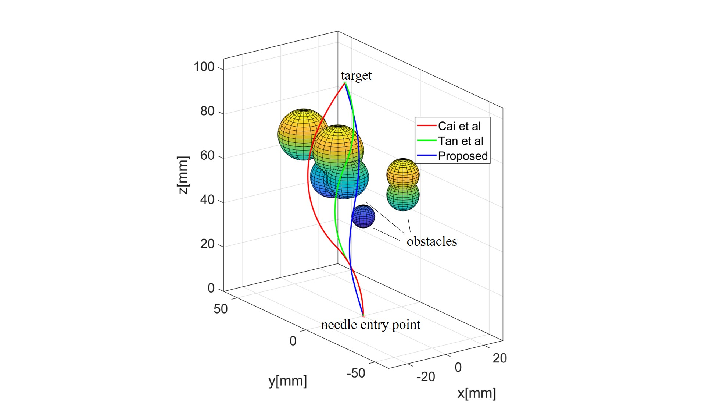

# Path Planning for Concentric Surgical Needles based on Artificial Potential Field
[IEEE Xpolre](https://ieeexplore.ieee.org/document/10865658/authors#authors)
## Citation
```
@INPROCEEDINGS{10865658,
  author={Zhang, Jing and Yuan, Jieting and Ye, Yongyin and Wang, Xiyu and Wu, Xiyun and Pan, Zhijie and Li, Mengtang},
  booktitle={2024 China Automation Congress (CAC)}, 
  title={Path Planning for Concentric Surgical Needles based on Artificial Potential Field}, 
  year={2024},
  volume={},
  number={},
  pages={606-611},
  keywords={Accuracy;Simulation;Prototypes;Simulated annealing;Needles;Cost function;Path planning;Real-time systems;Safety;Robots;Robot modeling;Path planning;Surgical needle;Artificial potential field},
  doi={10.1109/CAC63892.2024.10865658}}
```
## Run
- Run `oneEx.m` to generate the path for needle. Environment can be changed in `line 5`
- Run `e1/2/3_loop.m` to get statistical results
- Parameters can be changed in `planning_5_1.m`


## Environment
- e1: 3D environment with 6 sphere obstacles, whose setting refers to [1]

- e2: 3D environment with 8 sphere obstacles, whose setting refers to [2]

- e3: 3D environment with 3 columnar obstacles


## Results
- **Cai et al.** [3]
- **Tan et al.** [1]

## Acknowledgments
Thanks to the authors of the paper [1] for kindly sharing their code of AI-PSO. 

## Reference
[1] Tan Z, Liang H-G, Zhang D, et al. (2022) Path planning of surgical needle: A new adaptive intelligent particle swarm optimization method. Transactions of the Institute of Measurement and Control 44(4): 766–774.  
[2] Tan Z, Zhang D, Liang H, et al. (2022) A new path planning method for bevel-tip flexible needle insertion in 3D space with multiple targets and obstacles. Control Theory and Technology 20(4): 525–535.  
[3] Cai C, Sun C, Han Y, et al. (2020) Clinical flexible needle puncture path planning based on particle swarm optimization. Computer Methods and Programs in Biomedicine 193: 105511.
